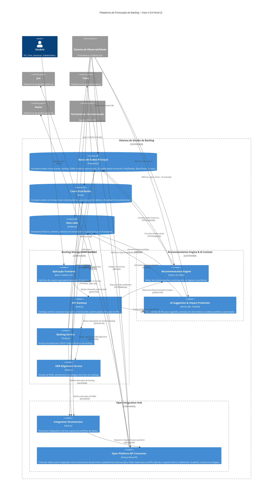

```mermaid
C4Container
    title Plataforma de Priorização de Backlog – Fase 4 (C4 Nível 2)

    Person(user, "Usuário", "PO, Time, Gestores, Stakeholders.")

    Container_Boundary(c1, "Sistema de Gestão de Backlog") {
        %% Domínio: BACKLOG MANAGEMENT
        Container_Boundary(backlog_ctx, "Backlog Management Context") {
            Container(frontend, "Aplicação Frontend", "React, Tailwind CSS", "Interface do usuário para gerenciamento do backlog.")
            Container(api_gateway, "API Gateway", "Node.js", "Gateway central, roteando requisições e fornecendo autenticação/unificação de APIs.")
            Container(backlog_service, "Backlog Service", "Node.js", "Serviço principal para CRUD e lógica de itens do backlog.")
            Container(okrs_service, "OKR Alignment Service", "Node.js", "Gestão de OKRs, alinhamento estratégico dos itens do backlog.")
        }

        %% Domínio: RECOMMENDATION & IA
        Container_Boundary(reco_ctx, "Recommendation Engine & AI Context") {
            Container(recommender_service, "Recommendation Engine", "Python (FastAPI)", "Motor de recomendações e priorizações via regras e heurísticas.")
            Container(ai_service, "AI Suggestion & Impact Prediction", "Python (ML, FastAPI)", "Microserviço de ML para sugestão, previsão de valor/esforço e análise preditiva customizada.")
        }

        %% Domínio: INTEGRAÇÕES
        Container_Boundary(integration_ctx, "Open Integration Hub") {
            Container(integration_service, "Integration Orchestrator", "Node.js", "Orquestra integrações internas e gerencia workflow de dados.")
            Container(openapi_connector, "Open Platform API Connector", "Node.js/OpenAPI", "Conector aberto para integração com ecossistemas de parceiros e plataformas externas (Jira, Trello, Asana etc.) via APIs abertas e suporte futuro a Webhooks, GraphQL e outras tecnologias.")
        }

        %% Bancos e Infra
        ContainerDb(db, "Banco de Dados Principal", "PostgreSQL", "Armazena dados transacionais, backlog, OKRs, estados operacionais. [Escalabilidade horizontal: sim][Deploy: Blue/Green, Canary]")
        ContainerDb(cache, "Cache Distribuído", "Redis", "Armazena dados em tempo real e intermediários para redução de latência. [Escalável horizontalmente]")
        ContainerDb(data_lake, "Data Lake", "S3/MinIO", "Armazena histórico, eventos, datasets de treinamento e logs brutos para IA/analytics.")
    }

    System_Ext(observability, "Sistema de Observabilidade", "Prometheus, Grafana, ELK", "Coleta métrica, logs e traces para monitoramento de toda a plataforma, incluindo IA e integrações.")
    System_Ext(jira, "Jira", "Plataforma de gestão (externa)")
    System_Ext(trello, "Trello", "Plataforma de gestão (externa)")
    System_Ext(asana, "Asana", "Plataforma de gestão (externa)")
    System_Ext(automation, "Ferramentas de Automação", "Zapier, Make, n8n", "Orquestra webhooks e automações de integrações.")

    %% Fluxos Principais
    Rel(user, frontend, "Interage via UI", "HTTPS")
    Rel(frontend, api_gateway, "Solicita operações de backlog, OKRs e análises", "JSON/HTTPS")
    Rel(api_gateway, backlog_service, "Roteia requisições do domínio backlog", "JSON/HTTPS")
    Rel(api_gateway, okrs_service, "Roteia requisições OKR Alignment", "JSON/HTTPS")
    Rel(api_gateway, recommender_service, "Roteia para Recommendation Engine", "JSON/HTTPS")
    Rel(api_gateway, ai_service, "Invoca predições e sugestões IA", "JSON/HTTPS")

    Rel(backlog_service, db, "Lê/Escreve", "TCP/PostgreSQL")
    Rel(okrs_service, db, "Lê/Escreve", "TCP/PostgreSQL")
    Rel(backlog_service, cache, "Lê/Escreve cache", "TCP/Redis")
    Rel(okrs_service, cache, "Lê/Escreve cache", "TCP/Redis")
    Rel(recommender_service, db, "Consulta dados históricos", "TCP/PostgreSQL")
    Rel(ai_service, db, "Consulta estados atuais", "TCP/PostgreSQL")
    Rel(recommender_service, data_lake, "Armazena/treina modelos", "S3/MinIO")
    Rel(ai_service, data_lake, "Armazena/recupera datasets", "S3/MinIO")

    Rel(frontend, api_gateway, "Realiza chamadas autenticadas", "JWT/HTTPS")
    Rel(backlog_service, integration_service, "Notifica alterações de backlog", "Event/JSON")
    Rel(okrs_service, integration_service, "Notifica alterações de OKRs", "Event/JSON")

    Rel(integration_service, openapi_connector, "Orquestra integrações para parceiros", "API/OpenAPI")
    Rel(openapi_connector, jira, "Integra e sincroniza", "REST API")
    Rel(openapi_connector, trello, "Integra e sincroniza", "REST API")
    Rel(openapi_connector, asana, "Integra e sincroniza", "REST API")
    Rel(automation, openapi_connector, "Dispara/recebe webhooks", "HTTP/Webhook")
    
    %% Observabilidade – monitoramento
    Rel_Back(recommender_service, observability, "Métricas, logs e traces")
    Rel_Back(ai_service, observability, "Métricas, logs e traces – IA avançada")
    Rel_Back(integration_service, observability, "Métricas e logs")
    Rel_Back(openapi_connector, observability, "Métricas e logs (integrações externas)")
    Rel_Back(db, observability, "Métricas do cluster DB")
    Rel_Back(cache, observability, "Métricas cluster Redis")
    Rel_Back(data_lake, observability, "Logs e métricas storage")
```